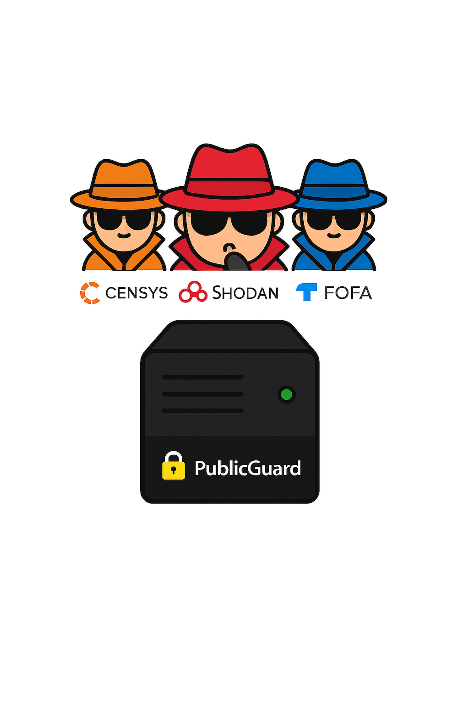

# 🛡 PublicGuard



Блокировка IP-адресов популярных Threat Intelligence платформ и систем сбора данных о публичных сервисах.

## Зачем это нужно

Публичные сканеры (Shodan, Censys, ZoomEye, FOFA, BinaryEdge и др.) ежедневно индексируют миллионы IP‑адресов.  

Любой сервис, даже тестовый или dev‑окружение, может случайно попасть в их базы и оказаться в Threat Intelligence отчётах. Это создаёт риски:

•  🔍 **Избыточная видимость** — инфраструктура, которая не должна быть публичной, становится доступной аналитикам и конкурентам.

•  ⚠️ **Повышенный риск атак** — тестовые и dev‑сервера часто настроены «на скорую руку» и содержат уязвимости.

•  🛡 **Лишние расходы на защиту** — приходится реагировать на шум, который можно было предотвратить заранее.

## Что делает проект

Мы собрали список известных диапазонов IP популярных сканирующих систем и сервисов сбора данных.  

Скрипт автоматически создаёт правила блокировки входящего трафика от этих адресов через `iptables` и `ipset`.

## Быстрый запуск

### Одна команда (рекомендуется)

```bash
curl -fsSL https://raw.githubusercontent.com/cleverg0d/PublicGuard/main/block_scanners.sh | sudo bash
```

Скрипт автоматически:
- Установит недостающие зависимости (iptables, ipset, curl, fail2ban)
- Скачает актуальный список IP с GitHub
- Создаст ipset для IPv4 и IPv6
- Настроит iptables правила с логированием
- Заблокирует трафик от всех сканеров из списка

### Локальная установка

```bash
git clone https://github.com/cleverg0d/PublicGuard.git
cd PublicGuard
sudo ./block_scanners.sh --sync --flush
```

## Что блокируется

- **Shodan** — популярный поисковик устройств в интернете
- **Censys** — платформа для поиска и анализа устройств
- **ZoomEye** (CN) — китайский поисковик уязвимостей
- **FOFA** (CN) — китайская платформа для сбора данных
- **BinaryEdge** — сервис для поиска уязвимостей
- **Shadowserver** — некоммерческая организация по безопасности
- **Rapid7 Project Sonar** — исследовательский проект по сканированию
- **Китайские коллекторы**: Baidu, Tencent Cloud, Alibaba Cloud

Полный список IP-адресов и диапазонов находится в [`scanners_list.txt`](scanners_list.txt).

## Проверка работы

```bash
# Проверить правила iptables
sudo iptables -L SCANNER_BLOCK_V4 -n -v
sudo ip6tables -L SCANNER_BLOCK_V6 -n -v

# Проверить содержимое ipset
sudo ipset list scanner_block_v4 | head -20
sudo ipset list scanner_block_v6 | head -20

# Посмотреть логи блокировок
sudo journalctl -k | grep SCANNER_BLOCK
# или
sudo dmesg | grep SCANNER_BLOCK
```

## Обновление списка

Список IP-адресов обновляется в репозитории. Чтобы применить обновления:

```bash
# Если запускали через curl|bash
curl -fsSL https://raw.githubusercontent.com/cleverg0d/PublicGuard/main/block_scanners.sh | sudo bash

# Если установили локально
cd PublicGuard
git pull
sudo ./block_scanners.sh --sync --flush
```

## Автоматическое обновление (cron)

Добавьте в crontab для ежедневного обновления:

```bash
sudo crontab -e
```

Добавьте строку:
```
0 2 * * * curl -fsSL https://raw.githubusercontent.com/cleverg0d/PublicGuard/main/block_scanners.sh | bash
```

## Опции скрипта

```bash
sudo ./block_scanners.sh [опции]

Опции:
  --sync           Скачать свежий список с GitHub перед применением
  --flush          Очистить ipset перед загрузкой новых записей
  --dry-run        Показать что будет заблокировано без применения правил
  --list <path>    Использовать другой файл со списком
  -h, --help       Показать справку
```

## Требования

- Linux с поддержкой `iptables` и `ipset`
- Права root (sudo)
- Скрипт автоматически установит недостающие зависимости

## Удаление правил

```bash
# Удалить цепочки iptables
sudo iptables -D INPUT -j SCANNER_BLOCK_V4
sudo iptables -F SCANNER_BLOCK_V4
sudo iptables -X SCANNER_BLOCK_V4

sudo ip6tables -D INPUT -j SCANNER_BLOCK_V6
sudo ip6tables -F SCANNER_BLOCK_V6
sudo ip6tables -X SCANNER_BLOCK_V6

# Удалить ipset
sudo ipset destroy scanner_block_v4
sudo ipset destroy scanner_block_v6
```

## Вклад в проект

Приветствуются Pull Request'ы с:
- Новыми IP-адресами сканеров (с указанием источника)
- Исправлениями существующих диапазонов
- Улучшениями скрипта

**Важно**: При добавлении IP-адресов указывайте источник и убедитесь, что это действительно сканеры, а не легитимные сервисы.

## Лицензия

MIT License

## ⚠️ Disclaimer

Блокировка сканеров может помешать легитимным исследованиям безопасности. Используйте на свой риск. Убедитесь, что блокировка не нарушает политики вашей организации.
